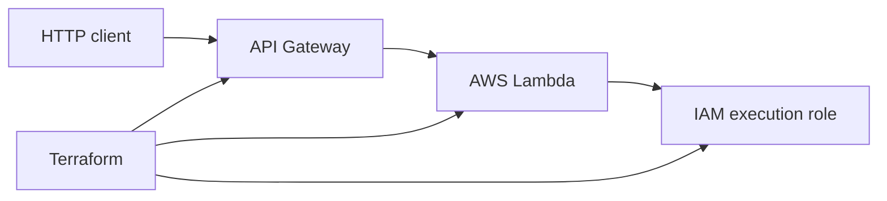

# Cloud Engineering Portfolio

> Solution package: [business and technical documentation](docs/solution-package.md)

Hands-on AWS and Terraform projects focused on serverless architecture, infrastructure as code, secure networking, and operational documentation. This repository is organized as a progression from a working serverless API toward larger cloud infrastructure builds.

## Current portfolio status

| Project | Status | Focus |
| --- | --- | --- |
| [Serverless API](project2-serverless-api/) | **Implemented** | API Gateway, Lambda, IAM, Terraform, and a working endpoint |
| [AWS 3-tier application](project1-3tier-app/) | **In progress** | VPC, public/private subnets, load balancing, compute, database, and logging |
| [Terraform infrastructure templates](project3-terraform-infra/) | **Scaffolded** | Reusable infrastructure patterns and modules |
| [Cloud resume](cloud-resume/) | **Scaffolded** | Static hosting and serverless visitor-counter architecture |

## Featured project: serverless API

The implemented project provisions an API Gateway endpoint backed by an AWS Lambda function using Terraform. The Lambda function returns a JSON health response, and the infrastructure is split into reusable modules for API Gateway and Lambda.

### Architecture



### Skills demonstrated

- Terraform provider and module configuration
- AWS Lambda packaging and handler design
- API Gateway integration
- IAM assume-role configuration
- Terraform outputs for deployment handoff
- Basic endpoint validation

Evidence: [Lambda working screenshot](project2-serverless-api/screenshots/Lambda-working.png).

## Planned architecture work

The next portfolio milestone is the AWS 3-tier application. Its intended design is:

```text
Internet
   |
Application Load Balancer (public subnets)
   |
EC2 application tier (private subnets)
   |
RDS MySQL database tier (isolated private subnets)
   |
S3 access logs and operational evidence
```

That project should be marked complete only after the Terraform modules, deployment steps, architecture diagram, and validation screenshots are present.

## Repository layout

```text
project2-serverless-api/  Implemented API Gateway + Lambda Terraform project
project1-3tier-app/       3-tier application scaffold
project3-terraform-infra/  Reusable Terraform scaffold
cloud-resume/              Cloud resume scaffold
```

## How I document projects

Each project should explain:

1. The business or engineering problem
2. The architecture and key design decisions
3. The Terraform or application implementation
4. How to deploy and validate it
5. Evidence, limitations, and cleanup steps

## Security and cleanup

This is a learning portfolio. Never commit AWS credentials, `.env` files, Terraform state, Terraform plans, generated `.terraform/` directories, or sensitive output. Review resource costs and destroy temporary AWS resources after testing.

## Related cloud projects

- [Microsoft 365 business environment](https://github.com/JuanMArroyo/m365-itsolutions-business)
- [Azure Kubernetes and ARC runners](https://github.com/JuanMArroyo/github-arc-aks)
- [Windows Server Active Directory homelab](https://github.com/JuanMArroyo/ad-windows-server-2022)
